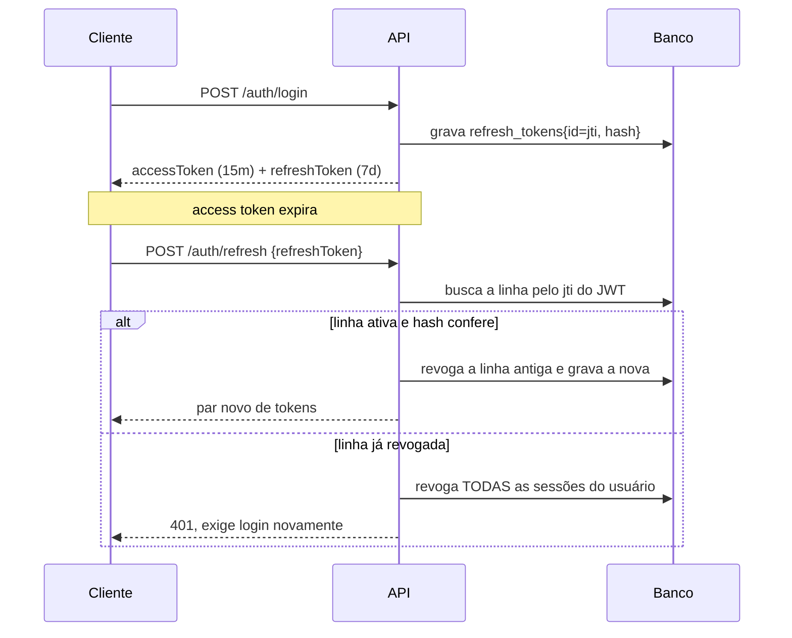

# conecthus-backend-av

API REST em NestJS criada a partir do template [backend-nestjs-template](https://github.com/Nobrinho/backend-nestjs-template). Já vem com autenticação JWT completa, controle de acesso por papel, persistência com Prisma, documentação OpenAPI navegável, logs estruturados, testes e containers.

O módulo `tasks` existe como recurso de referência: é um CRUD completo com paginação, busca e regra de ownership, feito para ser copiado quando você criar o primeiro recurso do seu domínio.

---

## Stack

| Camada | Escolha |
| --- | --- |
| Framework | NestJS 12 (ESM, TypeScript 6) |
| Banco | PostgreSQL 17 com Prisma 7 e driver adapter `@prisma/adapter-pg` |
| Autenticação | JWT de acesso curto + refresh token rotacionado, Passport |
| Autorização | RBAC por decorator, com guard global |
| Documentação | Swagger UI e OpenAPI 3 em `/docs` |
| Validação | `class-validator` nos DTOs, Zod nas variáveis de ambiente |
| Logs | pino com id de requisição e redação de campos sensíveis |
| Testes | Vitest, unidade e e2e |
| Lint | oxlint |

---

## Pré-requisitos

- Node.js 22.12 ou superior
- Docker, para subir o Postgres
- npm 10 ou superior

> O `package-lock.json` está versionado de propósito. O npm 10.9.8 tem um bug ao montar a árvore de peers do Vitest 4 do zero (`Cannot read properties of null (reading 'edgesOut')`); com o lockfile presente ele instala normalmente. Se você apagar o lockfile e reinstalar, use npm 11.

---

## Começando

```bash
cp .env.example .env
docker compose up -d db
npm install && npm run prisma:migrate && npm run db:seed && npm run start:dev
```

A API sobe em `http://localhost:3000/api/v1` e a documentação em `http://localhost:3000/docs`.

O seed cria duas contas, ambas com a senha `senhaSegura1`:

| Email | Papel |
| --- | --- |
| `admin@exemplo.com` | ADMIN |
| `ana.silva@exemplo.com` | USER |

---

## Documentação da API

A Swagger UI fica em `/docs` e o documento OpenAPI puro, que ferramentas de geração de cliente consomem, em `/docs-json`.

Para testar rotas protegidas pela própria página:

1. Execute `POST /auth/login` com uma das contas do seed.
2. Copie o `accessToken` da resposta.
3. Clique em **Authorize** no topo e cole o token, sem o prefixo `Bearer`.

O token fica guardado entre recarregamentos da página. Para publicar a API sem expor a documentação, defina `SWAGGER_ENABLED=false`.

As descrições vêm de duas fontes: os decorators `ApiOperation` nos controllers e os comentários JSDoc dos DTOs. O plugin do Swagger está ligado em `nest-cli.json` com `introspectComments`, então documentar um campo é escrever um comentário acima dele, sem repetir a informação em `ApiProperty`.

---

## Endpoints

Todas as rotas ficam sob `/api/v1`. A coluna Acesso diz o que a rota exige.

### auth

| Método | Rota | Acesso | O que faz |
| --- | --- | --- | --- |
| `POST` | `/auth/register` | público | Cria a conta e já devolve o par de tokens. O papel é sempre `USER`. |
| `POST` | `/auth/login` | público | Autentica e devolve o par de tokens. |
| `POST` | `/auth/refresh` | público | Troca o refresh token por um par novo e invalida o antigo. |
| `POST` | `/auth/logout` | público | Encerra a sessão do refresh token enviado. Idempotente. |
| `POST` | `/auth/logout-all` | autenticado | Encerra todas as sessões do usuário. |
| `GET` | `/auth/me` | autenticado | Dados do usuário do token. |

As três primeiras estão sob o limite estrito de `THROTTLE_CREDENTIALS_LIMIT`.

### users

| Método | Rota | Acesso | O que faz |
| --- | --- | --- | --- |
| `POST` | `/users` | ADMIN | Cria usuário podendo definir papel e status. |
| `GET` | `/users` | ADMIN | Lista paginada, com `search`, `role` e `isActive`. |
| `GET` | `/users/:id` | dono ou ADMIN | Busca pelo id. |
| `PATCH` | `/users/:id` | dono ou ADMIN | Atualiza. Mudar `role` ou `isActive` exige ADMIN. |
| `PATCH` | `/users/:id/password` | só o dono | Troca a senha, exigindo a senha atual. Responde 204. |
| `DELETE` | `/users/:id` | ADMIN | Remove. Tarefas e sessões caem em cascata. Responde 204. |

### tasks

| Método | Rota | Acesso | O que faz |
| --- | --- | --- | --- |
| `POST` | `/tasks` | autenticado | Cria a tarefa em nome de quem chamou. |
| `GET` | `/tasks` | autenticado | Lista paginada, com `search`, `status` e `ownerId`. |
| `GET` | `/tasks/:id` | dono ou ADMIN | Busca pelo id. |
| `PATCH` | `/tasks/:id` | dono ou ADMIN | Atualiza os campos enviados. |
| `DELETE` | `/tasks/:id` | dono ou ADMIN | Remove. Responde 204. |

Usuário comum só enxerga as próprias tarefas. O filtro `ownerId` é ignorado para ele e só vale para ADMIN.

### health

| Método | Rota | Acesso | O que faz |
| --- | --- | --- | --- |
| `GET` | `/health` | público | Checa banco e heap. Responde 503 se alguma checagem falhar. |

---

## Contratos de resposta

**Listagens** sempre devolvem o mesmo envelope, montado por `buildPaginatedResult` em [src/common/dto/paginated-result.dto.ts](src/common/dto/paginated-result.dto.ts):

```json
{
  "data": [],
  "meta": {
    "total": 42,
    "page": 1,
    "limit": 20,
    "totalPages": 3,
    "hasNextPage": true,
    "hasPreviousPage": false
  }
}
```

A query aceita `page` a partir de 1, `limit` até 100 e `order` com `asc` ou `desc` sobre a data de criação. Passar um `limit` acima do máximo devolve 400, não um valor truncado em silêncio.

**Erros** têm um formato só, produzido pelo `AllExceptionsFilter`:

```json
{
  "statusCode": 400,
  "message": ["title must be a string"],
  "error": "Bad Request",
  "path": "/api/v1/tasks",
  "timestamp": "2026-09-11T01:54:26.059Z",
  "requestId": "e0911fdc-a3d4-4559-aed9-6885beecb73c"
}
```

O campo `message` é uma string, ou uma lista quando vem da validação. O `requestId` é o mesmo do header `x-request-id` e da linha de log, o que permite ir do print de um cliente até o log do servidor.

Erros do Prisma são traduzidos antes de virarem resposta, em [src/common/filters/prisma-error.mapper.ts](src/common/filters/prisma-error.mapper.ts):

| Código | Vira | Situação |
| --- | --- | --- |
| `P2002` | 409 | Violação de campo único |
| `P2025` | 404 | Registro não encontrado |
| `P2003` | 400 | Chave estrangeira inválida |
| `P2014` | 400 | Relação obrigatória violada |

Qualquer outro erro não tratado vira 500 com a mensagem genérica `Erro interno do servidor`. O detalhe real vai para o log, nunca para o cliente.

**Validação de entrada** usa `whitelist` e `forbidNonWhitelisted`. Campos não declarados no DTO não são ignorados em silêncio: a requisição é recusada com 400. Isso evita que um cliente desatualizado grave lixo sem ninguém perceber.

---

## Observabilidade

Os logs saem em JSON estruturado via pino. Em desenvolvimento passam pelo `pino-pretty`; em produção vão em JSON puro, que é o que os coletores esperam.

Cada requisição ganha um id, reaproveitando o header `x-request-id` quando o cliente ou um proxy já mandou um. O mesmo id volta na resposta e aparece no corpo dos erros.

Campos sensíveis são redigidos antes de chegar ao transporte: `authorization`, `cookie`, `set-cookie`, `password`, `currentPassword`, `newPassword` e `refreshToken`. A rota de health não é registrada, para que o log não vire ruído de sonda.

A configuração está em [src/infra/logger/logger.config.ts](src/infra/logger/logger.config.ts).

---

## Variáveis de ambiente

Todas são validadas com Zod no boot ([src/config/env.validation.ts](src/config/env.validation.ts)). Se faltar alguma, a aplicação não sobe e a mensagem lista exatamente o que está errado.

| Variável | Padrão | Para que serve |
| --- | --- | --- |
| `NODE_ENV` | `development` | `development`, `test` ou `production` |
| `PORT` | `3000` | Porta HTTP |
| `API_PREFIX` | `api` | Prefixo das rotas, que ficam em `/<prefixo>/v1/...` |
| `CORS_ORIGINS` | `*` | Origens liberadas, separadas por vírgula |
| `LOG_LEVEL` | `info` | Nível do pino, de `fatal` a `trace` |
| `DATABASE_URL` | — | String de conexão do Postgres |
| `JWT_ACCESS_SECRET` | — | Segredo do access token, mínimo 32 caracteres |
| `JWT_ACCESS_TTL` | `15m` | Validade do access token |
| `JWT_REFRESH_SECRET` | — | Segredo do refresh token, obrigatoriamente diferente do de acesso |
| `JWT_REFRESH_TTL` | `7d` | Validade do refresh token |
| `THROTTLE_TTL` | `60000` | Janela do rate limit geral, em milissegundos |
| `THROTTLE_LIMIT` | `120` | Requisições por janela |
| `THROTTLE_CREDENTIALS_TTL` | `60000` | Janela do limite estrito de login, cadastro e refresh |
| `THROTTLE_CREDENTIALS_LIMIT` | `10` | Tentativas por janela nessas rotas |
| `SWAGGER_ENABLED` | `true` | Publica ou não a documentação |
| `SWAGGER_PATH` | `docs` | Caminho da Swagger UI |

Gere segredos fortes com:

```bash
node -e "console.log(crypto.randomBytes(48).toString('base64url'))"
```

---

## Scripts

| Script | O que faz |
| --- | --- |
| `npm run start:dev` | Sobe com recarga automática |
| `npm run build` | Compila para `dist/` |
| `npm run start:prod` | Roda o build compilado |
| `npm run typecheck` | Checagem de tipos sem emitir arquivos |
| `npm run lint` / `lint:fix` | oxlint |
| `npm run format` | Prettier |
| `npm test` / `test:watch` / `test:cov` | Testes de unidade |
| `npm run test:e2e` | Testes de ponta a ponta |
| `npm run prisma:migrate` | Cria e aplica uma migration em desenvolvimento |
| `npm run prisma:deploy` | Aplica as migrations pendentes, para produção |
| `npm run prisma:reset` | Derruba e recria o banco de desenvolvimento |
| `npm run prisma:studio` | Abre o navegador de dados do Prisma |
| `npm run db:seed` | Popula o banco com dados de exemplo |

---

## Estrutura

```
src/
  main.ts                 bootstrap: cria a aplicação, configura e escuta
  app.module.ts           módulo raiz, registra os guards globais
  config/
    env.validation.ts     schema Zod das variáveis de ambiente
    configuration.ts      configuração tipada, consumida via ConfigService
    app-setup.ts          helmet, CORS, prefixo, validação, filtros
    swagger.config.ts     documento OpenAPI e a UI
  common/
    decorators/           Public, Roles, CurrentUser, ApiPaginatedResponse,
                          CredentialRateLimit
    dto/                  paginação e envelope de erro
    filters/              filtro global e tradução dos erros do Prisma
    guards/               RolesGuard
    interceptors/         TimeoutInterceptor
    types/                AuthenticatedUser e os payloads dos tokens
  infra/
    prisma/               PrismaService, módulo global e o barrel do client
    hash/                 HashService (argon2 para senha, SHA-256 para token)
    logger/               configuração do pino
  modules/
    auth/                 cadastro, login, refresh, logout, estratégia JWT
    users/                CRUD de usuários
    tasks/                recurso de exemplo, molde para novos módulos
    health/               sonda para orquestradores
prisma/
  schema.prisma           modelos e enums
  migrations/             histórico versionado
  seed.ts                 dados de desenvolvimento
test/                     testes e2e e o helper que sobe a aplicação
```

`src/generated/prisma` guarda o client gerado. Não está versionado: o `postinstall` recria a pasta a cada `npm install`.

---

## Modelo de dados

Definido em [prisma/schema.prisma](prisma/schema.prisma). As tabelas usam nome em plural e snake_case via `@@map`, enquanto o código continua usando o nome do modelo.

| Modelo | Tabela | Papel |
| --- | --- | --- |
| `User` | `users` | Conta, com `email` único, `passwordHash`, `role` e `isActive` |
| `RefreshToken` | `refresh_tokens` | Uma linha por sessão emitida, com hash, validade e revogação |
| `Task` | `tasks` | Recurso de exemplo, com dono, status e prazo |

Enums: `Role` com `USER` e `ADMIN`, e `TaskStatus` com `TODO`, `IN_PROGRESS` e `DONE`. Adicionar um papel novo em `Role` já o torna utilizável no decorator `Roles`, sem nenhuma outra mudança.

Chaves são UUID. As relações de `RefreshToken` e `Task` com `User` têm `onDelete: Cascade`, então remover uma conta leva junto as sessões e as tarefas. Há índices em `refresh_tokens(userId)`, `refresh_tokens(expiresAt)`, `tasks(ownerId, status)` e `tasks(createdAt)`, que cobrem as consultas das listagens.

---

## Como funciona a autenticação

**Tudo é protegido por padrão.** O `JwtAuthGuard` está registrado como guard global, então uma rota nova já nasce exigindo token. Abrir uma rota é um ato explícito, com o decorator `Public`. O caminho contrário, abrir por padrão, transforma qualquer esquecimento em vazamento.

**O access token é curto e o refresh é rotacionado.** Cada chamada a `POST /auth/refresh` invalida o token apresentado e devolve um par novo, então um refresh token vazado só serve uma vez. O token em si nunca vai para o banco: guardamos o hash SHA-256, e o `id` da linha viaja como `jti` dentro do JWT.

**Reuso é tratado como roubo.** Se um refresh token já revogado reaparece, a explicação mais provável é que alguém copiou o token antes do dono usá-lo. Nesse caso todas as sessões da conta são encerradas de uma vez, e o usuário precisa fazer login de novo.



**Papéis são checados por metadata.** O `RolesGuard` roda depois da autenticação e lê o decorator `Roles`. Rotas sem o decorator passam com qualquer usuário autenticado.

```ts
@Roles(Role.ADMIN)
@Delete(':id')
remove(@Param('id', ParseUUIDPipe) id: string) {}
```

**Senha e token usam hashes diferentes de propósito.** Senha vai em argon2id, que é lento para encarecer força bruta. Refresh token vai em SHA-256, porque ele é gerado pelo servidor e já tem entropia alta: não existe dicionário a testar, e um hash rápido evita somar latência a cada renovação de sessão.

---

## Adicionando um módulo novo

Copie `src/modules/tasks` e siga o mesmo formato. Cada camada tem uma responsabilidade só:

1. **DTOs** em `dto/`. Um para entrada (`CreateXDto`), um para atualização (`UpdateXDto`, normalmente `PartialType` do primeiro), um para a query da listagem (estendendo `PaginationQueryDto`) e um para a resposta (`XResponseDto`, com um `fromEntity` estático). A resposta é sempre uma classe própria, nunca a entidade do Prisma: é isso que garante que um campo interno não vaze junto.
2. **Repositório**, o único arquivo que conhece o Prisma. Isso deixa o service testável com um mock pequeno.
3. **Service**, onde mora a regra. Inclusive a de visibilidade: colocá-la aqui, e não no controller, faz a regra valer também quando outro service chamar o método.
4. **Controller** fino, só roteamento e documentação. Use `ApiTags`, `ApiOperation` e `ApiPaginatedResponse` nas listagens.
5. **Módulo**, registrando controller, service e repositório. Depois importe em `AppModule`.

Para um modelo novo no banco, edite `prisma/schema.prisma` e rode:

```bash
npm run prisma:migrate -- --name descreva-a-mudanca
```

---

## Testes

Os testes de unidade instanciam os services direto, com mocks no lugar dos repositórios. São rápidos e não precisam de banco:

```bash
npm test
```

Os testes e2e sobem a aplicação inteira em memória contra um Postgres descartável, o serviço `db-test` do compose, na porta 5433. Eles usam o mesmo `configureApp` do `main.ts`, então exercitam a validação, o prefixo e o tratamento de erro reais:

```bash
docker compose up -d db-test
npm run test:e2e
```

As migrations são aplicadas automaticamente antes das suítes por `test/global-setup.ts`, e as tabelas são limpas entre elas. A configuração do ambiente de teste está em `.env.test`, versionado porque não contém segredo de verdade.

---

## Docker

```bash
docker compose up --build
```

Sobe o Postgres, aplica as migrations e inicia a API em `http://localhost:3000`.

O `Dockerfile` é multi-estágio e a imagem final roda como usuário não-root, com `tini` como PID 1 para que o `SIGTERM` chegue ao Node e o desligamento gracioso do Nest aconteça de verdade. Há um `HEALTHCHECK` apontando para `/api/v1/health`.

As migrations rodam em um serviço próprio (`migrate`), que executa uma vez e sai, e não no start da API. Isso evita que várias réplicas tentem migrar o banco ao mesmo tempo em uma implantação real.

---

## Detalhes que valem saber

**Este projeto é ESM.** O `package.json` tem `"type": "module"` e o TypeScript está em `nodenext`, que é o padrão do `nest new` na versão 12. Na prática isso significa uma regra só: **todo import relativo termina em `.js`**, mesmo apontando para um arquivo `.ts`.

```ts
import { UsersService } from './users.service.js';
```

**Versões estão fixadas por um motivo.** A tag `latest` do pacote `prisma` aponta hoje para um release candidate da versão 8, enquanto o `@prisma/client` estável é 7. Instalar sem fixar quebra o par CLI/client. Da mesma forma, o `@nestjs/cli` 12 depende de TypeScript 6, não do 7 que está em `latest`.

**Há `overrides` no `package.json`.** Três deles corrigem advisories em dependências transitivas e um libera o `@nestjs/throttler` 6, cujos peers ainda não declaram o NestJS 12. O resultado é `npm audit` limpo. Revise esse bloco quando atualizar as dependências: ele deixa de ser necessário assim que os pacotes de origem atualizarem.

**As mensagens de validação do `class-validator` saem em inglês.** É o padrão da biblioteca. Para traduzir uma regra específica, passe a opção `message`, como já é feito em `CreateUserDto`.

**A estratégia JWT consulta o banco a cada requisição.** É deliberado: sem a consulta, um usuário desativado continuaria entrando até o token expirar. Se o custo pesar no seu caso, troque por um cache curto em vez de remover a checagem.
